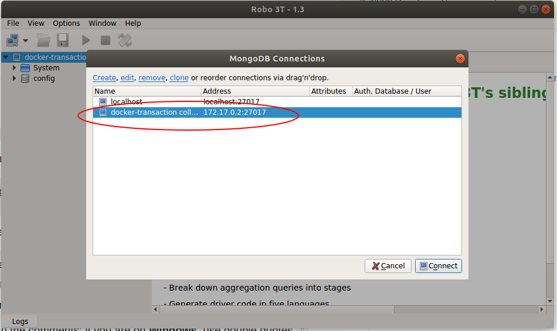

# Cosmos Transaction Collector

### Task Description

Figure out which transactions on cosmos mainnet `(cosmoshub-2)` were done using Lunie.

We used special memos from within Lunie: `(Sent via Lunie)`.

#### Requirements

- All transactions that were sent from Lunie are stored in some database.
- The database syncs and then stays up to date with the chain.
- The collector is dockerized.
- The docker container accepts an environment variable STARGATE which holds the url to a cosmos REST server that should be used to crawl the chain.

#### Advice

For testing purposes use https://stargate.cosmos.network (at the end using this endpoint wasn't really a good idea...).
You can find API documentation here: https://cosmos.network/rpc/
We propose a simple REST server, but you can also provide a shell script.

#### Evaluation 

- The docker container should provide some documented way to get the stored transactions.
- Important parts of your code should be unit tested
- The code should be documented
- The repo should have some information about the task
- You were able to follow the instructions

## Project Setup

In case you are using the non-dockerized version, don't forget to install MongoDB and start it first with `sudo service mongod start`. 

For docker, you just need to pull the mongo image:
`docker pull mongo`

`git clone https://github.com/anagutjor/lunie-transaction-collector`

`cd lunie-transaction-collector`

`npm i`

### Run the docker version

`npm run docker` 

### Run the not-dockerized version

`npm run start`
OR
`npm start` 
OR
`node index.js`

### Run tests

`npm run test`

### Store Data from the Docker Container

To extract the data stored by the docker first you need the `mongo` container running.
You can check if it is effectively running with `docker ps`. If you have `npm run docker` it will be up. If you only want to extract the data, you can also simply do `docker run mongo` to get only this container up and running.

Then do
`docker exec mongo sh -c 'exec mongodump --host localhost:27017 --out /dumps/'`
to create a dump folder within the docker container.

We will copy this dump folder into our system with:
`docker cp mongo:/dumps $HOME/Downloads/`

Next, we only need to restore the transactionCollector database into our local system. For that, we will go to the `Downloads` directory with `cd ~/Downloads` and there execute
`mongorestore -d transactionCollector transactionCollector`

Now we have the database also in our local system.

You could also connect to the docker `mongo` container with [Robo 3T](https://robomongo.org/) and creating a new connection using the container's ip in your system and port `27017`. 

To know the container's ip run this command, courtesy of StackOverflow: 
`docker inspect -f '{{range .NetworkSettings.Networks}}{{.IPAddress}}{{end}}' container_id`

Remember you'd need the `mongo` container running to establish a connection.

## Remarks

1. Finally I didn't use the https://stargate.cosmos.network endpoint. The server providing this API was too faulty and slow, giving every now and then a `502 Error`.

So I thank Mario for sharing with me his fantastic endpoint instead, at https://lunie.mariopino.es. What an incredible difference between the two of them!

2. It is important to note that in order to be able ro run the the crawler in both a docker container and localhost, I used an environment variable in `schema.js`, `MONGODIR`. This variable will change its value depending on whether we use the `npm run start` script or the `npm run docker` one.

The mechanism used to achieve this is quite straight-forward. Simply deleting the last line in the `.env` and rewriting it with the desired value (either `localhost` or `mongo`, the container name).